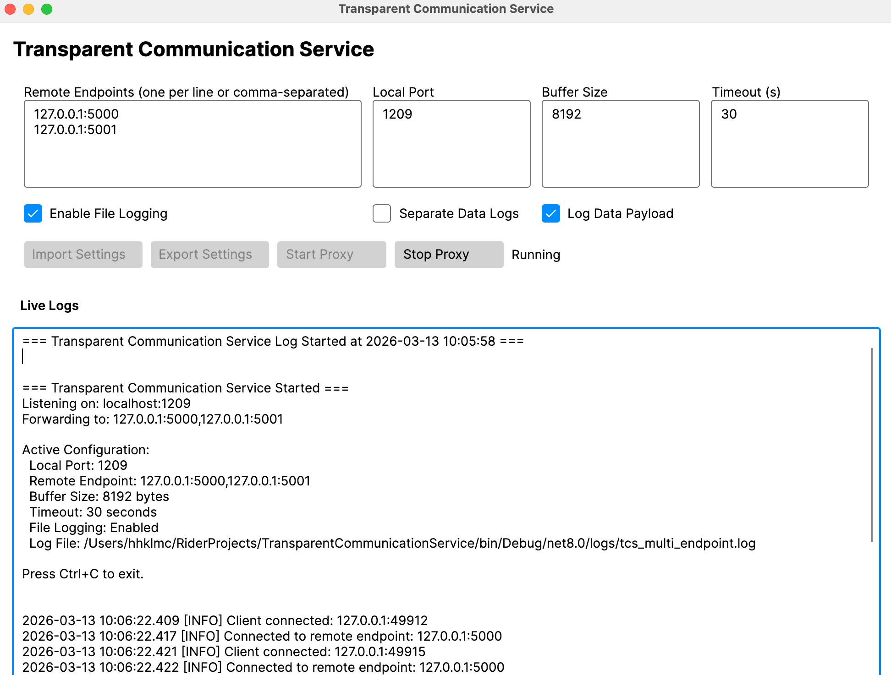

# Transparent Communication Service (TCS)

Transparent Communication Service is a cross-platform desktop TCP proxy for forwarding one client connection to one or more remote endpoints. The current version uses an Avalonia UI for configuration, runtime control, and live log viewing.

## Overview

TCS listens on a local TCP port, accepts incoming client traffic, and forwards that traffic to every configured remote endpoint. Responses from any connected remote endpoint are relayed back to the original client.

This is useful when you need to:

- bridge legacy clients to remote services behind VPNs or firewalls
- duplicate traffic to multiple systems at once
- inspect and log modem or device communication
- run a configurable proxy without building your own tooling

## Current Application Model

The application now starts as a desktop app instead of a console-first executable.

- Avalonia desktop UI for configuration and control
- Start and stop the proxy from the main window
- Import settings from an existing JSON file
- Export the current UI settings to JSON
- Live log output inside the app
- Settings loaded from `settings.json` on startup
- Current settings automatically saved to `settings.json` when the proxy starts
- Optional file logging to the `logs` directory

## Features

- TCP fan-out proxy to multiple remote endpoints
- Desktop UI built with Avalonia
- Live in-app log viewer
- Configurable local port, buffer size, and timeout
- Configurable file logging, separate data logs, and payload logging
- Settings file support
- Import/export settings from the desktop UI
- Automatic persistence of the active settings on proxy start
- IPv4, hostname, and bracketed IPv6 endpoint parsing
- Asynchronous connection handling with a concurrent connection limit

## Requirements

- .NET 8 SDK
- Windows, Linux, or macOS

## Build And Run

```bash
git clone https://github.com/hkilimci/TransparentCommunicationService.git
cd TransparentCommunicationService
dotnet build TransparentCommunicationService.sln
dotnet run --project TransparentCommunicationService.csproj
```

## Using The App

When the app opens, the main window shows the current configuration and live log area.

1. Enter one or more remote endpoints.
2. Set the local listening port.
3. Adjust buffer size and timeout if needed.
4. Choose logging options.
5. Optionally use `Import Settings` or `Export Settings`.
6. Click `Start Proxy`.
7. Click `Stop Proxy` to shut it down.

## Screenshots

Main window while the proxy is running:



Live log view with payload logging:


### Remote Endpoint Format

Supported endpoint formats:

- `127.0.0.1:5000`
- `myserver.local:5001`
- `[::1]:5002`

You can enter endpoints:

- one per line
- comma-separated
- semicolon-separated

At least one valid remote endpoint is required.

## Configuration

The UI loads its initial values from `settings.json` in the application directory.

### Default Values

| Setting | Default |
|---|---|
| `localPort` | `1209` |
| `bufferSize` | `8192` |
| `timeout` | `30` |
| `enableFileLogging` | `true` |
| `separateDataLogs` | `false` |
| `logDataPayload` | `true` |

### settings.json

```json
{
  "endpoints": [
    "192.168.1.100:5000",
    "10.0.0.50:5001"
  ],
  "localPort": 1209,
  "bufferSize": 8192,
  "timeout": 30,
  "enableFileLogging": true,
  "separateDataLogs": false,
  "logDataPayload": true
}
```

Notes:

- `settings.json` is copied to the output directory during build.
- Invalid endpoint entries are ignored when settings are loaded.
- The current desktop flow reads settings on startup; runtime edits are made from the UI.
- Starting the proxy overwrites the default `settings.json` with the current UI values.

## Logging

TCS supports both on-screen and file-based logging.

- The main window displays live log messages while the proxy is running.
- When file logging is enabled, logs are written under `logs/`.
- If multiple remote endpoints are configured, the main log file is `logs/tcs_multi_endpoint.log`.
- If separate data logs are enabled with multiple endpoints, the data log file is `logs/tcs_multi_endpoint_data.log`.
- With a single endpoint, filenames include the endpoint host and port.

## How It Works

1. TCS starts a TCP listener on the configured local port.
2. Each accepted client connection is forwarded to every configured remote endpoint.
3. Client data is fanned out to all connected remote targets.
4. Data received from remote targets is relayed back to the client.
5. Activity is written to the in-app log view and, optionally, to log files.

## Development Notes

- Target framework: `.NET 8`
- Desktop framework: `Avalonia 11.1.3`
- Output assembly name: `tcs`

## License

This project is licensed under the MIT License. See `LICENSE.txt`.
